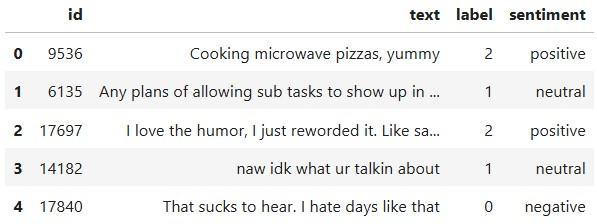
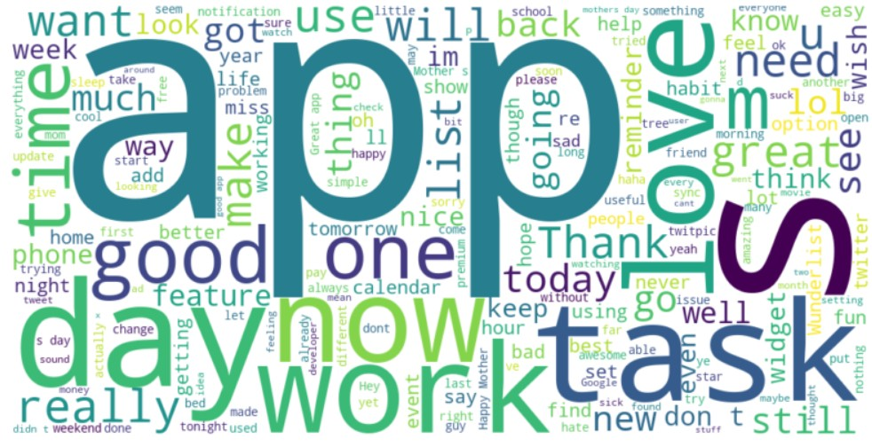
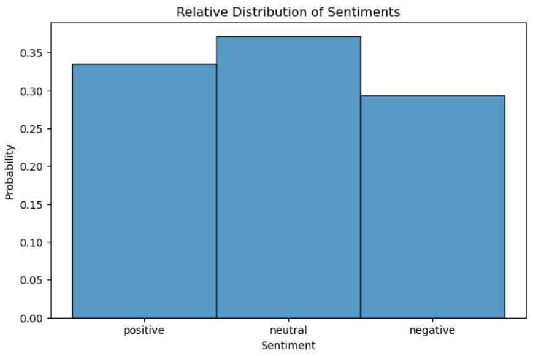
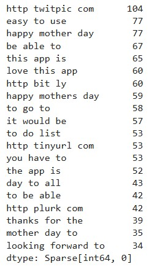
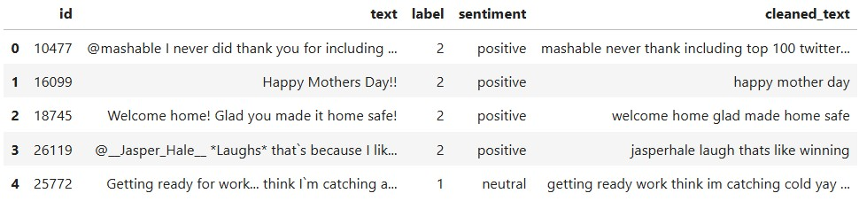
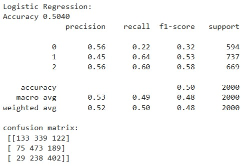
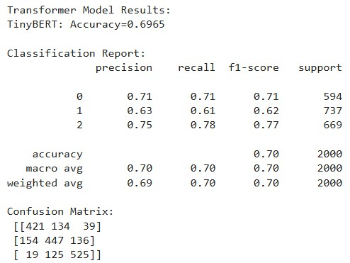
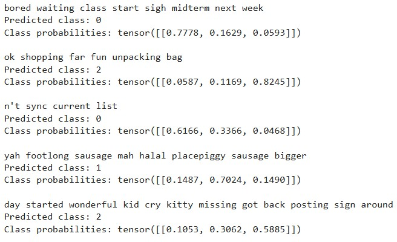
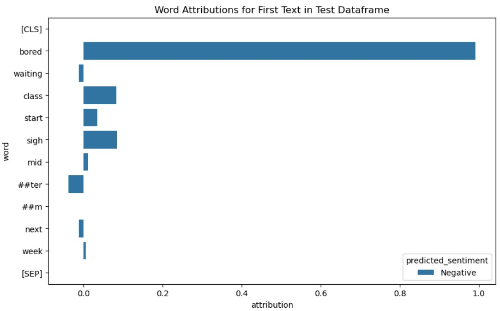
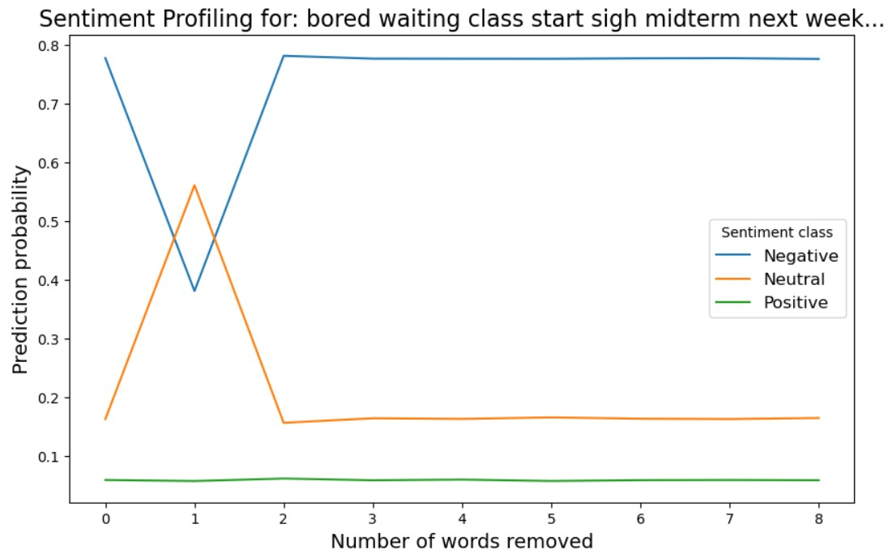

# Social Media Comments Sentiment Analysis
Data Science project concerning developing a sentiment analysis model as an early warning system for a social media platform, to warn users about whether the comment they are about to post is negative, by incorporating a check of the comment sentiment at submission. If the sentiment is primarily negative, the user could see a popup indicating if they are sure they want to post this negative comment. The purpose of this is to reduce the amount of negative comments that the social media platform is seeing.

## Quick Links
- Streamlit app for interactive data and model predictions analysis: [Streamlit App](https://social-media-texts-sentiment-analysis.streamlit.app/)
- Jupyter Notebook of the development of the sentiment analysis model: [Jupyter Notebook](sentiment_analysis.ipynb)
- Social media texts dataset: [Social Media Texts Dataset](https://huggingface.co/datasets/Sp1786/multiclass-sentiment-analysis-dataset)
- Other projects I have made: [Portfolio Website](https://lucashoffschmidt.github.io/)

## Technologies Used
**Tools and Platforms**
- Development: JupyterLab
- Deployment: Streamlit Community Cloud

**Libraries**
- Data Analysis: `pandas`, `numpy`
- Visualization: `matplotlib`, `seaborn`, `wordcloud`, `shap`, 
- Machine Learning: `scikit-learn`, `xgboost`
- File Handling: `pathlib`
- Text Processing: `re`
- Dataset Handling: `datasets`
- Natural Language Processing: `nltk`, `gensim`
- Deep Learning: `torch`, `transformers`
- Storage: `joblib`
- Deployment: `streamlit`, `onnxruntime`

## Process
**Data Collection**
- Acquired dataset of social media texts from huggingface and converted it to a pandas DataFrame.

- Reduced dataset to 10000 rows to reduce computation time.
- Performed key word analysis on the texts and defined the attributes of the dataset.   

**Exploratory Data Analysis**
- Checked the dataframe for null values and incorrect data types.
- Checked the statistical distribution of attributes.
- Created a wordcloud of the most used words in the dataframe texts.

- Checked the distribution of sentiment types.

- Performed a trigram analysis for the 3-word-pairs that occurred most frequently in the texts.
 

**Data Preprocessing**
- Cleaned the text by converting it to lowercase, keeping only standard characters, removing stopwords and reducing words to their root.

- Removed the id column, which doesn't provide value for modeling.   

**Model Training and Evaluation**
- Split the data into training and testing dataframes and converted texts to average vectors for each word.
- Defined machine learning models with their hyperparameter grids and performed grid search to find the best models.
- Evaluated models on accuracy, precision, recall and f1-score.

- Trained the TinyBERT deep learning model and evaluated it against the machine learning models. 
 

**Model Interpretation**
- Calculated the predicted class and class probabilities for the first 5 texts of the test dataset.

- Got the word attributions for the first text of the test dataframe.

- Performed sentiment analysis for individual word removals of the first text in the test dataframe.
 

**Model Deployment**
- Exported the TinyBERT model to the ONNX runtime format and quantized it to reduce its size.
- Saved model tokenizer and the sentiment dataframe.
- Developed a [Streamlit App](https://social-media-texts-sentiment-analysis.streamlit.app/) with a sentimentbased wordcloud and a realtime sentiment inference text field.   

## Insights
- The texts likely originate from an array of different social media platforms.
- The average sentiment for the texts lean towards positivity.
- The deep learning transformer model TinyBERT is relatively good at predicting sentiment at an accuracy of 70% and if the text is not overly convoluted, it could be even higher than that.
- The TinyBERT model can make predictions in real-time, with an inference speed of less than 1 second, making it optimal as part of an early warning system for a social media platform.    

## Improvements
- We could use the entire dataset, rather than just 10000 rows from it, to improve the model's generalizability.
- We could use heavier transformer models such as RoBERTa, which increases the computation time, but usually increases the accuracy. The increased computation time, might however be frustrating for the user.
